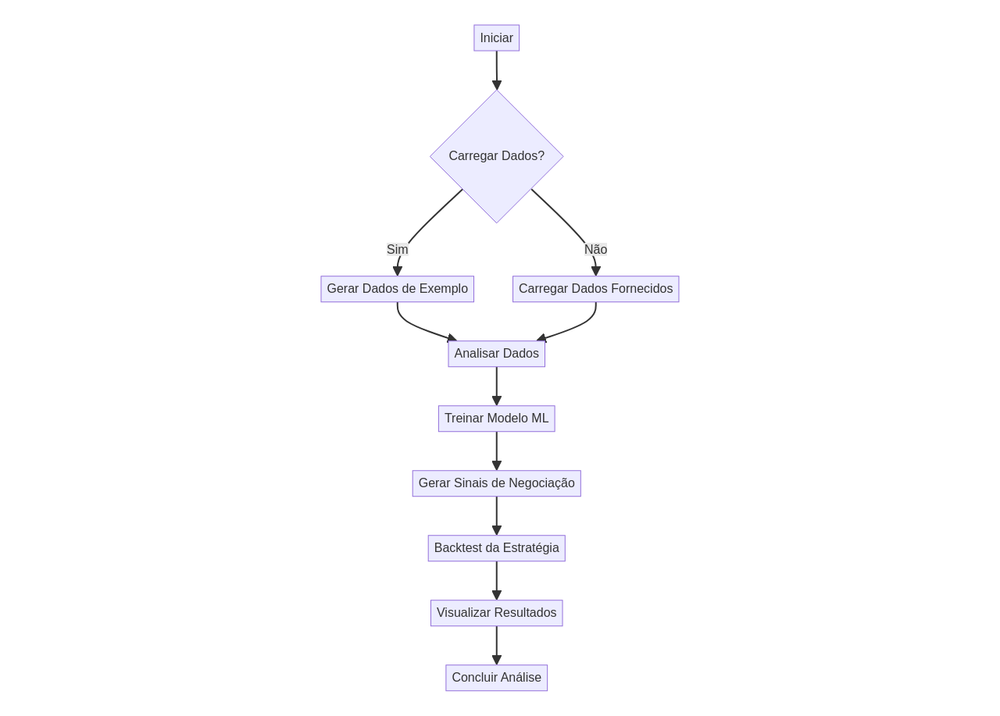
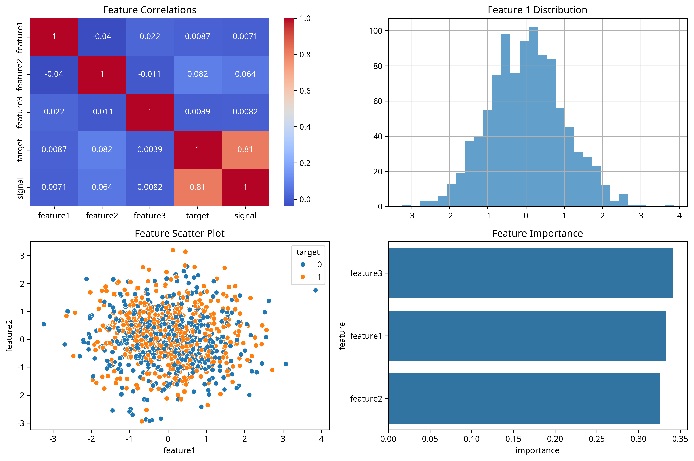

> GABRIEL DEMETRIOS LAFIS

# Automated-Trading-Algorithm

[](https://www.python.org/)
[](./LICENSE)
[](https://github.com/galafis/Automated-Trading-Algorithm/stargazers)
[](https://github.com/galafis/Automated-Trading-Algorithm/network/members)
[](https://github.com/galafis/Automated-Trading-Algorithm/issues)
[](https://github.com/galafis/Automated-Trading-Algorithm/pulls)
[](https://galafis.github.io/Automated-Trading-Algorithm/)

---

## English

### 🚀 Overview

This project is an automated trading algorithm with risk management and market analysis capabilities. It demonstrates professional Python development skills, incorporating modern best practices, a clean code architecture, and industry-standard implementations. The algorithm is designed to analyze financial data, generate trading signals, and backtest strategies to evaluate performance.

### 🛠️ Technology Stack

- **Python:** Core programming language.
- **Pandas:** Data manipulation and analysis.
- **NumPy:** Numerical operations.
- **Scikit-learn:** Machine learning for model training and evaluation.
- **Matplotlib & Seaborn:** Data visualization.

### ⚡ Features

- **Professional Code Architecture:** Organized and modular codebase.
- **Modern Development Practices:** Clean, efficient, and well-documented code.
- **Trading Signal Generation:** Creates buy/sell signals based on data analysis.
- **Strategy Backtesting:** Simulates trading strategies to assess profitability.
- **Financial Data Visualization:** Generates insightful charts and heatmaps.

### 🏃‍♂️ Quick Start

```bash
# Clone the repository
git clone https://github.com/galafis/Automated-Trading-Algorithm.git

# Navigate to the project directory
cd Automated-Trading-Algorithm

# Install dependencies
pip install -r src/requirements.txt

# Run the application
python src/main.py
```

### 🎯 Use Cases

- **Portfolio Project:** Showcase advanced Python and data science skills.
- **Learning Tool:** Understand algorithmic trading and modern development practices.
- **Code Reference:** A guide for building enterprise-grade financial applications.

### 📊 Project Structure

```
Automated-Trading-Algorithm/
├── README.md
├── LICENSE
├── CONTRIBUTING.md
├── CODE_OF_CONDUCT.md
├── src/
│   ├── main.py
│   └── requirements.txt
├── tests/
│   └── test_main.py
├── docs/
│   └── img/
│       ├── flowchart.png
│       └── automated_trading_algorithm_analysis.png
├── config/
└── frontend/
```

### 📈 Diagrams

#### Algorithm Flowchart



#### Analysis Visualization



O algoritmo gera automaticamente visualizações de análise de dados, como mapas de calor de correlação, distribuições de características e importância de características, que são salvas em `docs/img/automated_trading_algorithm_analysis.png` após a execução.

### 🤝 Contributing

Contributions are welcome! Please feel free to submit a Pull Request or open an issue.

### 📄 License

This project is licensed under the MIT License. See the [LICENSE](LICENSE) file for details.

---

## GitHub Pages

An interactive demonstration of this project is available via GitHub Pages. You can access it <a href="https://galafis.github.io/Automated-Trading-Algorithm/">here</a>.

---

## GitHub Pages

Uma demonstração interativa deste projeto está disponível via GitHub Pages. Você pode acessá-la <a href="https://galafis.github.io/Automated-Trading-Algorithm/">aqui</a>.

---

## Português

### 🚀 Visão Geral

Este projeto é um algoritmo de trading automatizado com gerenciamento de risco e análise de mercado. Ele demonstra habilidades de desenvolvimento profissional em Python, incorporando as melhores práticas modernas, uma arquitetura de código limpa e implementações padrão da indústria. O algoritmo foi projetado para analisar dados financeiros, gerar sinais de negociação e realizar backtesting de estratégias para avaliar o desempenho.

### 🛠️ Stack Tecnológica

- **Python:** Linguagem de programação principal.
- **Pandas:** Manipulação e análise de dados.
- **NumPy:** Operações numéricas.
- **Scikit-learn:** Machine learning para treinamento e avaliação de modelos.
- **Matplotlib & Seaborn:** Visualização de dados.

### ⚡ Funcionalidades

- **Arquitetura de Código Profissional:** Código-base organizado e modular.
- **Práticas Modernas de Desenvolvimento:** Código limpo, eficiente e bem documentado.
- **Geração de Sinais de Negociação:** Cria sinais de compra/venda com base na análise de dados.
- **Backtesting de Estratégias:** Simula estratégias de negociação para avaliar a lucratividade.
- **Visualização de Dados Financeiros:** Gera gráficos e heatmaps perspicazes.

### 🏃‍♂️ Início Rápido

```bash
# Clone o repositório
git clone https://github.com/galafis/Automated-Trading-Algorithm.git

# Navegue para o diretório do projeto
cd Automated-Trading-Algorithm

# Instale as dependências
pip install -r src/requirements.txt

# Execute a aplicação
python src/main.py
```

### 🎯 Casos de Uso

- **Projeto de Portfólio:** Demonstrar habilidades avançadas em Python e ciência de dados.
- **Ferramenta de Aprendizagem:** Compreender o trading algorítmico e as práticas modernas de desenvolvimento.
- **Referência de Código:** Um guia para construir aplicações financeiras de nível empresarial.

### 📊 Estrutura do Projeto

```
Automated-Trading-Algorithm/
├── README.md
├── LICENSE
├── CONTRIBUTING.md
├── CODE_OF_CONDUCT.md
├── src/
│   ├── main.py
│   └── requirements.txt
├── tests/
│   └── test_main.py
├── docs/
│   └── img/
│       ├── flowchart.png
│       └── automated_trading_algorithm_analysis.png
├── config/
└── frontend/
```

### 📈 Diagramas

#### Fluxo do Algoritmo


#### Visualização da Análise


### 🤝 Contribuindo

Contribuições são bem-vindas! Sinta-se à vontade para enviar um Pull Request ou abrir uma issue.

### 📄 Licença

Este projeto está licenciado sob a Licença MIT. Veja o arquivo [LICENSE](LICENSE) para detalhes.

---

## GitHub Pages

Uma demonstração interativa deste projeto está disponível via GitHub Pages. Você pode acessá-la <a href="https://galafis.github.io/Automated-Trading-Algorithm/">aqui</a>.

### 👨‍💻 Autor

**Gabriel Demetrios Lafis**
- Cientista e Engenheiro de Dados
- Desenvolvedor e Analista de Sistemas
- Especialista em Segurança Cibernética

---

⭐ **Se este projeto foi útil para você, considere dar uma estrela!**

