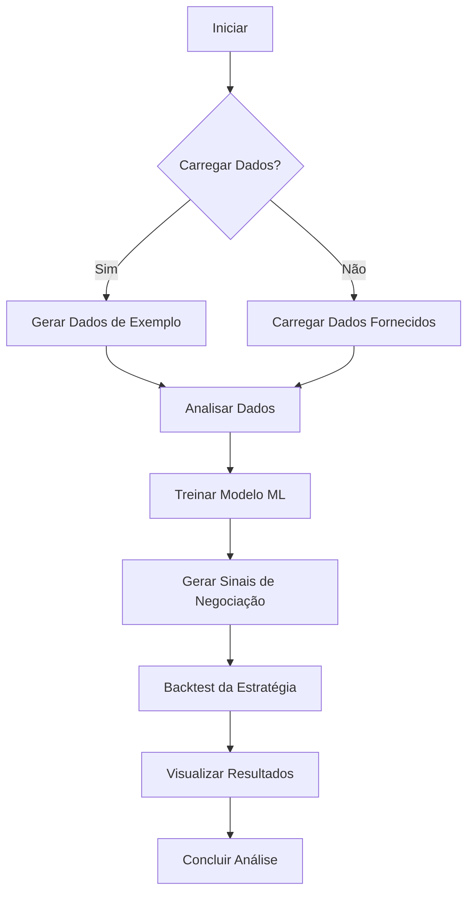

```mermaid
graph TD
    A[Iniciar] --> B{Carregar Dados?}
    B -- Sim --> C[Gerar Dados de Exemplo]
    B -- Não --> D[Carregar Dados Fornecidos]
    C --> E[Analisar Dados]
    D --> E
    E --> F[Treinar Modelo ML]
    F --> G[Gerar Sinais de Negociação]
    G --> H[Backtest da Estratégia]
    H --> I[Visualizar Resultados]
    I --> J[Concluir Análise]
```
