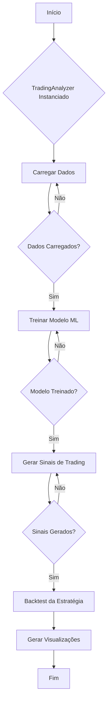

```mermaid
graph TD
    A[Início] --> B{TradingAnalyzer Instanciado}
    B --> C[Carregar Dados]
    C --> D{Dados Carregados?}
    D -- Sim --> E[Treinar Modelo ML]
    D -- Não --> C
    E --> F{Modelo Treinado?}
    F -- Sim --> G[Gerar Sinais de Trading]
    F -- Não --> E
    G --> H{Sinais Gerados?}
    H -- Sim --> I[Backtest da Estratégia]
    H -- Não --> G
    I --> J[Gerar Visualizações]
    J --> K[Fim]
```
